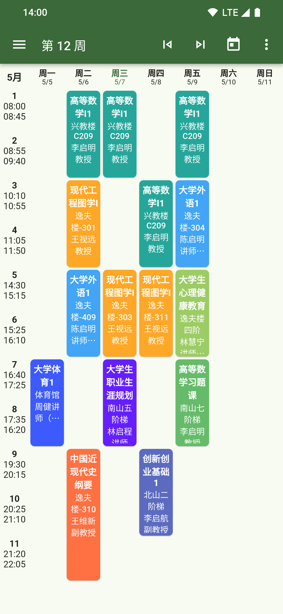
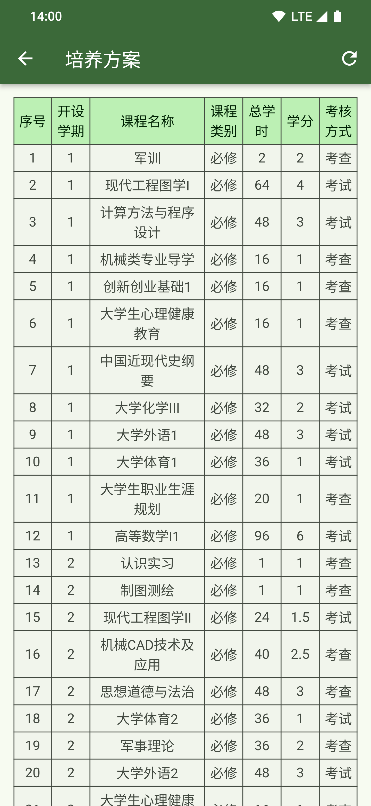
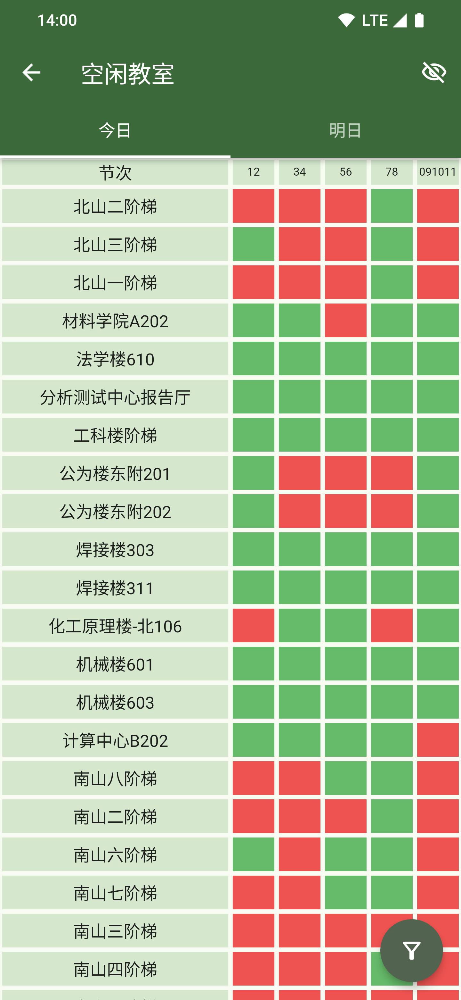
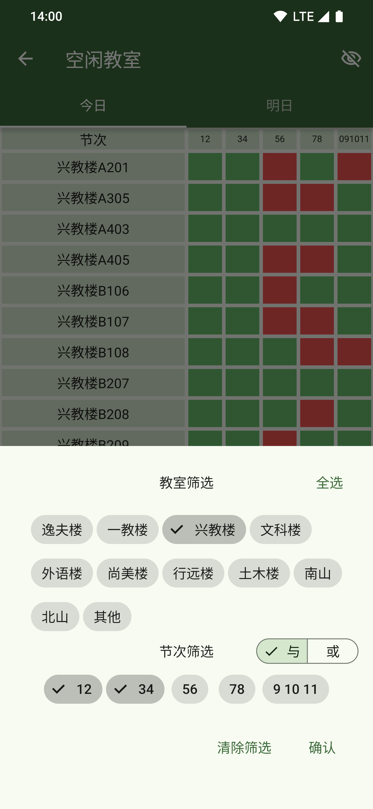
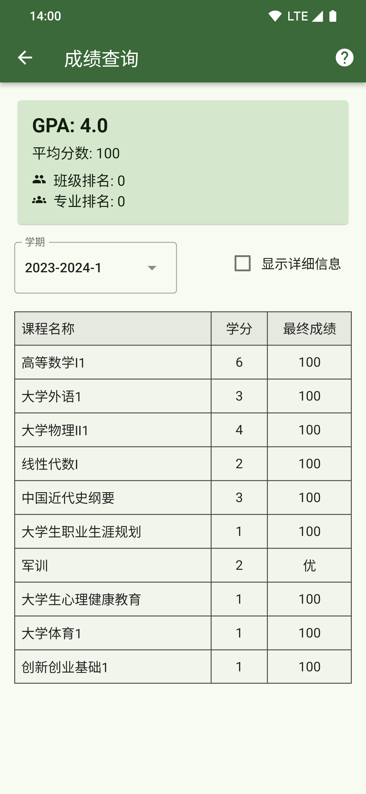
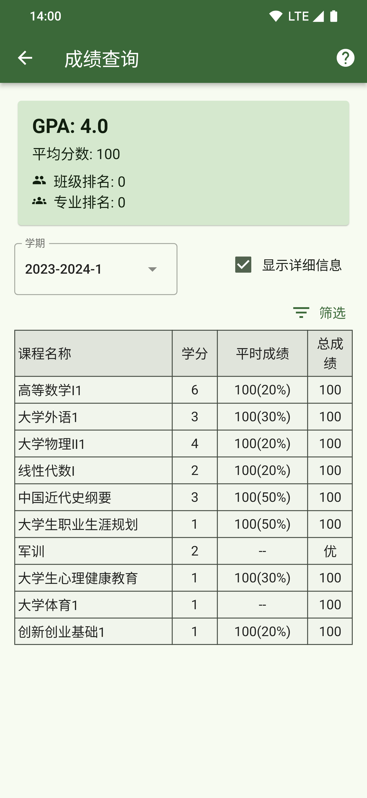
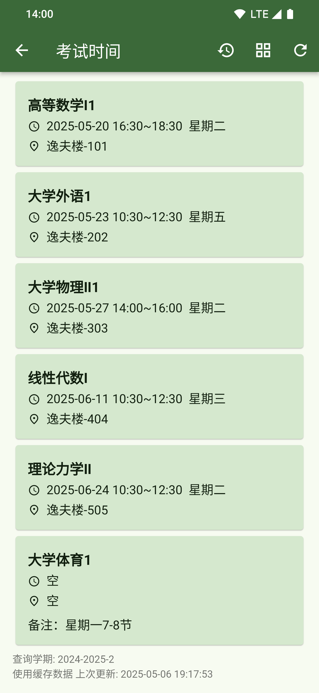
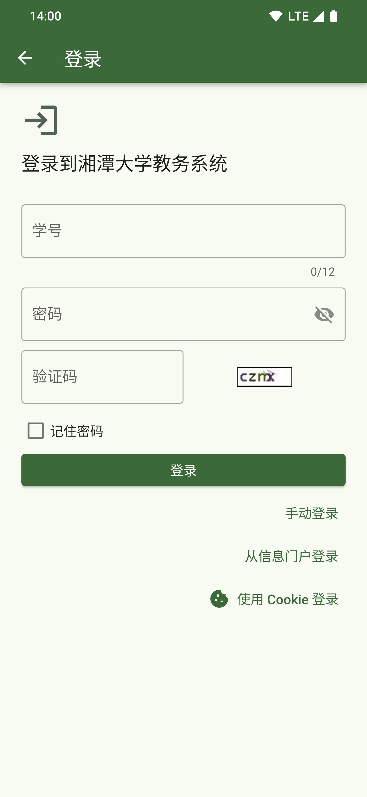

# Sachet

 

[简体中文](./README.md) | [English](./README_EN.md)

## 介绍

Sachet 是一款使用 Flutter 构建的应用，旨在为湘潭大学学生提供轻快流畅的课程表，便捷的空闲教室查询，以及直观全面的成绩信息等核心教务功能以及其他便捷服务

**核心功能：**

- 课程表查看

- 空闲教室查询

- 考试时间查询

- 成绩查询

- 聚合校内常用链接

**优点：**

- 启动速度快，秒开看课表

- 免费开源

- 用户信息只发送到教务系统的服务器，严格保护隐私

- ~~跨平台~~ （🚧）

## 应用截图

 
 
 
  

 
  
 
 

## 下载

|     平台     | 安装包 |
|--------------|----------|
| Android（安卓）| [APK(arm64-v8a)](https://github.com/wyvern1723/sachet/releases/download/v0.2.1/sachet-v0.2.1-arm64-v8a.apk) |

[所有发布](https://github.com/wyvern1723/sachet/releases/latest)

## 更多

Flutter version: 3.24.5

给开发者：

- [README_DEV](./README_DEV.md)
