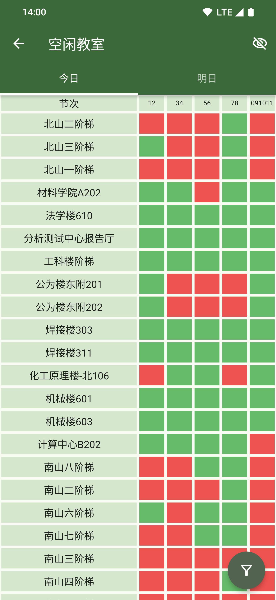
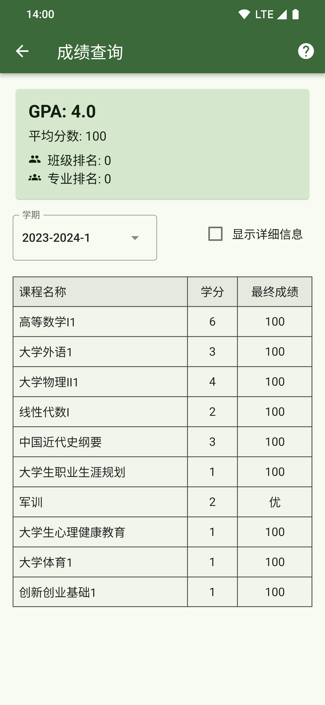
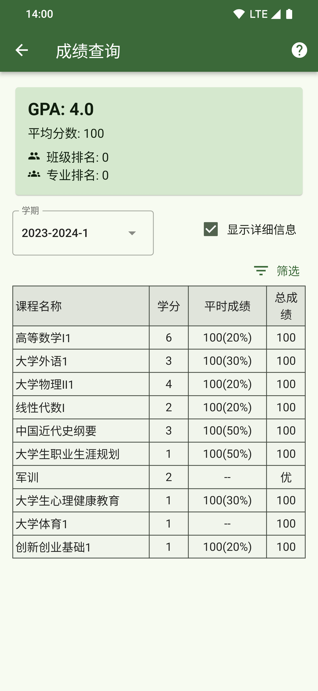
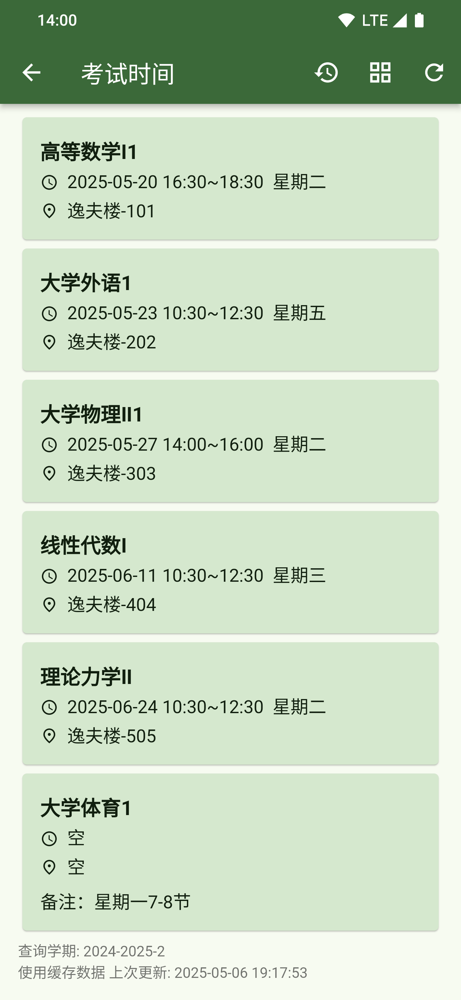
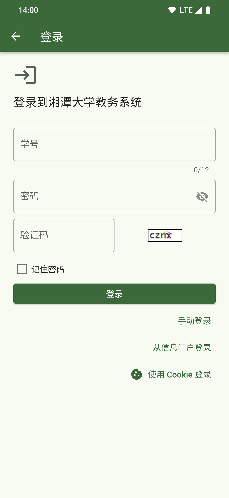

# Sachet

  

  
  
  

  <a href="./README.md">简体中文</a> | <a href="./README_EN.md">English</a>

## 介绍

Sachet 是一款使用 Flutter 构建的应用，旨在为湘潭大学学生提供轻快流畅的课程表，便捷的空闲教室查询，以及直观全面的成绩信息等核心教务功能以及其他便捷服务

**核心功能：**

- 课程表查看

- 空闲教室查询

- 考试时间查询

- 成绩查询

- 聚合校内常用链接

**特性：**

- 启动速度快，秒开看课表

- 免费开源

- 遵循 Material Design 设计规范，支持动态取色与预测性返回手势

- 用户信息只发送到教务系统的服务器，严格保护隐私

- 跨平台（支持 Android、Windows、Linux，目前仅发布 Android 版本，如需 Windows 或 Linux 版本欢迎 [联系我](#contact) 或提交 [Issue](https://github.com/wyvern1723/sachet/issues) 反馈。开发者也可参考 [README_DEV.md](./README_DEV.md) 自行构建）

## 应用截图

  
  
  
  

  
  
  
  

## 下载

| 平台 | 安装包 |
| --- | --- |
| Android（安卓） | [APK(arm64-v8a)](https://github.com/wyvern1723/sachet/releases/download/v0.8.0/sachet-v0.8.0-arm64-v8a.apk) |

[所有发布](https://github.com/wyvern1723/sachet/releases/latest)

[更新日志(CHANGELOG)](./CHANGELOG.md)

## 给开发者

Flutter version: 3.24.5

湘潭大学在 `2024-2025-2` 之前使用 [强智教务系统](https://jwxt.xtu.edu.cn/jsxsd/)，`2025-2026-1` 之后使用 [正方教务系统(版本V-9.0)](https://jw.xtu.edu.cn/jwglxt/)

- 强智教务系统，相关文件见: [lib/services/qiangzhi_jwxt/](./lib/services/qiangzhi_jwxt/) (实现登录，获取个人课表、培养方案、空闲教室、考试成绩、考试时间)

- 正方教务系统，相关文件见: [lib/services/zhengfang_jwxt/](./lib/services/zhengfang_jwxt/) (🚧 正在施工，目前已实现登录、获取个人课表、空闲教室、考试成绩、考试时间、绩点排名)

- 强智教务系统的图片验证码自动识别
  - 模型文件: [assets/models/captcha_model.tflite](./assets/models/captcha_model.tflite) (使用 TensorFlow v2.15.0 训练生成，基于 1748 张验证码图片数据集。在 80%/20% 划分的训练/测试集上，测试准确率达到 100%。最终模型使用全部数据集重新训练生成)

  - 调用代码: [lib/services/qiangzhi_jwxt/login/captcha_recognizer.dart](./lib/services/qiangzhi_jwxt/login/captcha_recognizer.dart)

开发环境配置和项目构建：

- [README_DEV](./README_DEV.md)

## Contact

maiI: `wyvern1723(AT)outlook[dot]com`

## License

[MIT License](./LICENSE)
